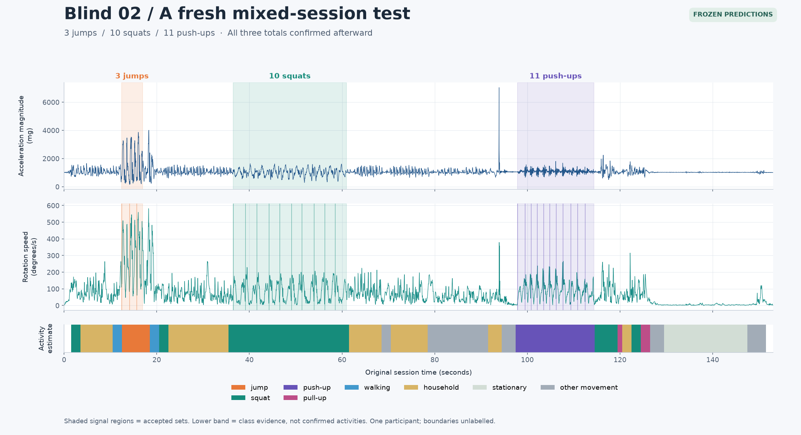
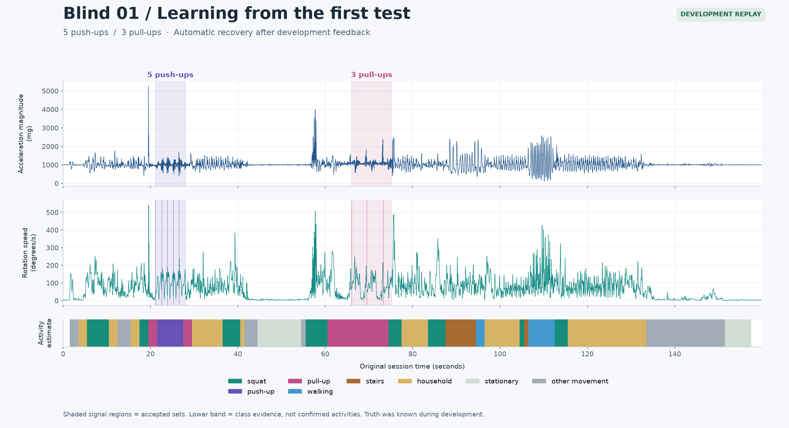
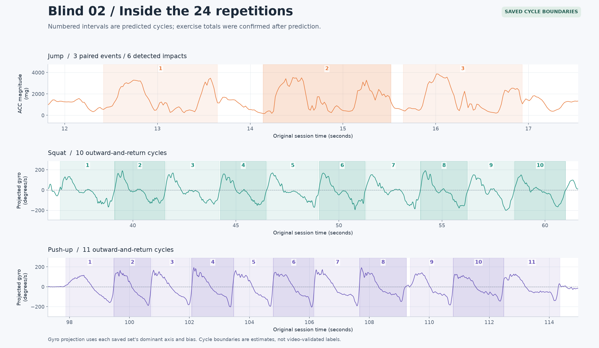

# Polar Activity Counter

**Record your movement. Find exercise sets. Count complete repetitions.**

A Python application that uses a **Polar Verity Sense** accelerometer and gyroscope
to recognize personal exercise patterns. Wear the sensor on your upper arm, record
a session, and get a timeline, estimated counts, and inspectable movement cycles.
Record beside your PC over Bluetooth, or use the sensor's memory and walk away.

The current **adaptive analyser** recognizes push-ups, pull-ups, squats and jumps
from personal reference recordings. Walking, stairs and ordinary movement appear
as activity estimates. It runs locally and produces PNG, JSON and CSV reports.

[Installation & user manual](docs/user_manual.md) ·
[How it works](docs/how_it_works.md) ·
[Results & figures](docs/examples.md) ·
[Future work](docs/roadmap.md)

## See it working

### Blind-02: a fresh test, confirmed after prediction

The model and analysis code were frozen before the activities were disclosed.
The program predicted **3 jumps → 10 squats → 11 push-ups**. The participant then
confirmed all three activities and counts, in that order.



**3 of 3 reported exercise sets matched; 24 repetitions; no extra accepted sets.**
This is one successful mixed session for one person wearing the sensor on the
left upper arm. It is not an overall accuracy percentage. Exact boundaries were
not independently annotated, and the colours between sets are classifier estimates.

### Blind-01: what improved after feedback

The first blind attempt exposed weaknesses in short sets and pull-up boundaries.
After that feedback, the adaptive engine recovers **5 push-ups and 3 pull-ups**
automatically from the same recording, alongside the intervening everyday movement.



This figure is a **retrospective development replay**: the activity order and counts
were known when the method was improved. Blind-02 was the subsequent fresh test.
Both recordings remain outside the personal model's training references.

### Look inside the count

Each shaded interval below is an accepted movement cycle from blind-02. A pulse
alone does not establish a repetition: the counter also looks for a return phase,
consistent timing and repeated motion. Jump counts use a separately calibrated
impact convention.



See [figure provenance and evaluation details](docs/examples.md), including the
preserved prediction hash and the limits of the user-confirmed reference counts.

## Current status

This is a working **personal prototype**, with physical Bluetooth recording,
sensor-memory recording, BLE download and USB download tested on Windows with a
Verity Sense running firmware 3.0.16. Hardware-free tests run on Windows and Linux
with Python 3.11 and 3.12.

| Available now | Practical limit |
|---|---|
| Automatic exercise boundaries and complete-cycle counting | A personal model is required for exercise names; none is bundled |
| Push-up, pull-up, squat and jump detectors | Few reference sessions from one participant; new people need their own references |
| Short sets, brief rests and incomplete pull-up attempts | Very short or unfamiliar movements may be missed or misclassified |
| Walking/stairs/background timeline | No stair direction or step count; sitting and standing are pooled |
| Motion consistency and relative pull-up excursion | Movement proxies, not an anatomical form or technique assessment |
| Local CSV/JSON/PNG outputs and acquisition diagnostics | Batch analysis after capture; no live rep display or mobile app yet |

There are known false positives in development recordings. The household check
produced zero counted sets over 65.36 seconds, including when excluded from training;
that short check does not establish reliable all-day behaviour. See the
[full adaptive evaluation](docs/adaptive_analysis.md).

## Install on Windows

Install [Python](https://www.python.org/downloads/windows/) and
[Git](https://git-scm.com/downloads/win). Python **3.11 or 3.12** is the tested path.
In PowerShell:

```powershell
git clone https://github.com/kerby2000/polar-activity-counter.git
cd polar-activity-counter
py -3.11 -m venv .venv
.\.venv\Scripts\python.exe -m pip install --upgrade pip
.\.venv\Scripts\python.exe -m pip install -e .
.\.venv\Scripts\python.exe -m polar_activity --help
```

Use `py -3.12` in the venv command if that is your installed version. Explicitly
using the venv's Python avoids PowerShell activation-policy and PATH surprises.
See the [manual](docs/user_manual.md) for interpreter troubleshooting, USB support,
reference training and a complete first-recording walkthrough.

### Try the software without a sensor

Generate an **artificial QA recording**, inspect it and run the generic counter:

```powershell
.\.venv\Scripts\python.exe scripts/make_synthetic_session.py data/raw/synthetic-demo
.\.venv\Scripts\python.exe -m polar_activity diagnose data/raw/synthetic-demo
.\.venv\Scripts\python.exe -m polar_activity plot data/raw/synthetic-demo
.\.venv\Scripts\python.exe -m polar_activity count data/raw/synthetic-demo
```

Use a new output folder on each run. This checks installation, decoding and report
generation. Its artificial waveforms/labels are not human exercise examples and
are not expected to reproduce the blind-test counts. Raw human recordings and
the original participant's personal model are not included in a fresh clone.

## Choose a recording mode

Here, **online means a live Bluetooth connection**, not an internet connection.
Both modes save motion data for later analysis on your PC.

| | Online: stream to PC | Offline: store in sensor |
|---|---|---|
| Start | `record` | `offline start` |
| During exercise | Keep Python running and stay in Bluetooth range | Wait for confirmation, then leave Bluetooth range; keep sensor on |
| Labels | Optional keyboard activity/set/count labels | Write down reference activities/counts afterward |
| Finish | `Q` or the requested duration | Return to range and run `offline sync` |
| Transfer | Samples are saved as they arrive | BLE sync, or stop via BLE then download via USB |
| Best fit | Nearby reference sessions and diagnostics | Pull-up bars, stairs and movement away from the PC |

Turn on sensor/heart-rate mode, close competing Polar app connections and replace
`YOUR_ID` with the ID shown by `scan`:

```powershell
.\.venv\Scripts\python.exe -m polar_activity scan --scan-timeout 30
.\.venv\Scripts\python.exe -m polar_activity verify --device YOUR_ID --output data/verity-capabilities.json
```

**Online:** wait for `READY` before exercising. Press `Q` to finish early.

```powershell
.\.venv\Scripts\python.exe -m polar_activity record --device YOUR_ID --duration 180 --subject me --sensor-position upper_arm_left --output data/raw/online-01
```

**Offline:** wait for `Internal ACC + GYRO recording confirmed at 52 Hz` and command
exit, exercise, then return and sync using the same folder:

```powershell
.\.venv\Scripts\python.exe -m polar_activity offline start --device YOUR_ID --subject me --sensor-position upper_arm_left --output data/raw/offline-01
.\.venv\Scripts\python.exe -m polar_activity offline sync data/raw/offline-01
```

These are two separate commands with your exercise **between** them. Ordinary
button-selected recording on the sensor is not a substitute for starting raw
ACC/GYRO recording through this app. See [offline details](docs/offline_recording.md)
and [optional USB download](docs/usb_recording.md).

## Teach it your movement, then analyse

Record known examples with consistent sensor placement, select active intervals
and build a personal model. The [reference manifest template](examples/references.example.json)
and [training walkthrough](docs/user_manual.md#train-your-personal-model) explain the
required files. Training uses activity-labelled signal windows; expected rep totals
are reserved for checking the result.

After creating your own `data/models/references.json`:

```powershell
.\.venv\Scripts\python.exe -m polar_activity train data/models/references.json --engine adaptive --output data/models/personal-adaptive.json
.\.venv\Scripts\python.exe -m polar_activity analyze data/raw/offline-01 --engine adaptive --model data/models/personal-adaptive.json
```

Open `data/raw/offline-01/analysis-adaptive/analysis.png` and `sets.csv`. Inference
finds exercise intervals from the signals; target labels, folder names, notes and
expected counts are not inputs. Keep a new mixed session out of training for an
honest test. **Include `--engine adaptive`**: the CLI retains `legacy` as its default
for compatibility with older models.

## The idea behind the app

The sensor measures acceleration and angular velocity in three dimensions. The
analyser aligns valid ACC/GYRO spans, extracts gravity-relative movement features,
and compares short windows with your labelled references. Class evidence proposes
an exercise interval; a separate detector checks whether it contains plausible
complete movement cycles. This separation helps reject everyday movements that
briefly resemble an exercise. Details, equations, references and known failure
modes are in [How it works](docs/how_it_works.md).

## Development and next steps

```powershell
.\.venv\Scripts\python.exe -m pip install -e ".[dev,experiment]"
.\.venv\Scripts\python.exe -m ruff check .
.\.venv\Scripts\python.exe -m ruff format --check .
.\.venv\Scripts\python.exe -m pytest -q
.\.venv\Scripts\python.exe -m pip check
```

The experiment extra is needed for the full comparison test suite, not ordinary
adaptive analysis. Acquisition tests use fake devices; passing CI does not certify
a new Bluetooth adapter. Your `data/` directory is ignored by Git and stays local
unless you deliberately share it.

Next priorities are broader mixed/background validation, more reference variety,
better unknown-movement rejection, a simpler training/review interface, and measured
long-session storage, battery and transfer performance. See the
[roadmap](docs/roadmap.md) for what is planned versus already implemented.

Technical references: [data format](docs/dataset_format.md),
[protocol](docs/protocol.md), [validation history](docs/validation.md),
[DTW/MM-Fit comparison](docs/exp_r1_report.md).
