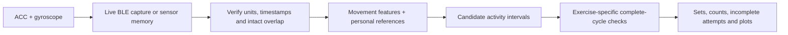

# How the activity counter works

An upper-arm sensor sees movement, not exercise names. Walking to a pull-up bar,
raising an arm, doing a repetition and stepping down can all produce large signals.
The application separates two decisions: **what movement does this resemble?** and
**does it contain a supported sequence of complete cycles?**

This document describes `--engine adaptive` (`personal-adaptive-v1`). The legacy
engine and experimental DTW comparisons remain available for reproducibility.

## From sensor to report

Online and offline capture feed the same analysis format. Online capture stores
incoming notifications; offline capture downloads recordings made in sensor memory
over BLE or USB. Both retain the source information needed to check conversion and
timing. Neither mode means the analyser runs continuously during exercise.

## 1. Preserve the measurement

The accelerometer supplies three axes in **mg** (1,000 mg is approximately one g).
The gyroscope supplies three axes in **degrees per second**. Acceleration includes
gravity: a stationary sensor still has an acceleration magnitude near 1,000 mg.
The configured normal-mode rate is 52 Hz; measured native packet timing on the
tested sensor was approximately 52.94 Hz. Reports distinguish configured and
measured rates rather than changing the raw timestamps to fit an assumption.

Decoders require the correct format and scale factors, retain integer sensor
timestamps, and expose gaps, duplicates and missing data. Analysis aligns ACC and
gyro only across intact common spans, filters before resampling to **25 Hz**, and
splits at data loss. It does not interpolate exercise motion across a disconnect.
Jump impacts are inspected in the native signal to retain their short peaks.

See [Data format](dataset_format.md), [Protocol](protocol.md) and
[Polar's Verity Sense developer guide](https://github.com/polarofficial/polar-ble-sdk/blob/3d15da61dd0c63e6be2582d03fd80f6c7ba02e11/documentation/products/PolarVeritySense.md)
for the acquisition interface and signal definitions.

## 2. Learn a personal feature bank

Training takes explicit activity-labelled intervals from reference recordings.
It stores features from four-second windows, one second apart. Expected repetition
counts do not enter training. The prepared development model has 191 overlapping
windows from eight recordings of one person; these are not 191 independent examples
of different people.

For each window, estimate a gravity direction from the mean acceleration vector:

$$\hat g = \frac{\operatorname{mean}(a)}{\|\operatorname{mean}(a)\|}.$$

Resolve acceleration and gyro into components parallel and transverse to that
direction. For example:

$$a_\parallel = a\cdot\hat g,\qquad
a_\perp = \sqrt{\max(0,\|a\|^2-a_\parallel^2)}.$$

The 13 features combine acceleration-magnitude percentiles, acceleration/gyro
variation, dominant gyro-axis energy, mean acceleration magnitude, and statistics
of the parallel/transverse components. Fixed scales put these features into
comparable numerical ranges. Absolute mean sensor X/Y/Z values are excluded.

This reduces sensitivity to a common rotation of the sensor coordinates. It does
not prove invariance to moving the sensor to another body part, strap slippage,
different technique, or a changing gravity estimate during vigorous motion.

For each new window, the classifier averages the RMS feature distances to the
nearest three reference windows of each class (or fewer if fewer exist). The
closest class is accepted only below the fixed 0.85 distance threshold. Very quiet
windows receive `stationary`; unsupported movement can remain `unknown`. Isolated
one-second class flips are smoothed. **Distances are not probabilities.**

Implementation: [adaptive.py](../src/polar_activity/adaptive.py),
[feature_vector](../src/polar_activity/experiments/signal.py).

## 3. Propose an exercise interval

Two seconds of exercise-class support can propose an interval. Gaps of up to three
seconds can be bridged through compatible quiet/unknown/other-movement evidence;
bounded two-second context helps inspect the beginning and end of the movement.
This prevents a brief rest from automatically becoming a new exercise set.

These proposals are deliberately broader than final counts. A squat-like colour
in the plot's lower band can remain visible even when the counter rejects the
proposal. The report preserves candidates, rejection evidence and accepted sets
separately so users can inspect that distinction.

## 4. Count complete motion

### Push-ups and squats

The counter searches 4-, 6-, 8- and 12-second windows for repeated structure in both
IMUs. Two periods can seed a short set; three repetitions are not required to fit
inside a seed. Autocorrelation proposes a period, with checks to avoid preferring
a near-equally-supported harmonic over the fundamental movement period.

A cycle must show outward **and return** angular motion, plausible duration and
amplitude, similarity to adjacent cycles, and limited net rotation. Both phase
choices can be considered, but their counts are never added together. Supported
cycles extend a set to its observed boundaries; a qualifying brief quiet pause can
join two parts without adding a repetition for the pause itself.

Implementation: [adaptive_counter.py](../src/polar_activity/adaptive_counter.py).

### Pull-ups

An upper-arm pull-up produces a characteristic excursion of the gravity-relative
arm direction. A baseline is selected from stable context, requiring low angular
speed, limited acceleration variation and consistent direction. Equally quiet but
incompatible poses produce an abstention rather than an arbitrary baseline.

A complete excursion needs an observed near-baseline origin, departure and return.
Starting the candidate while the arm is already raised must not create an extra
repetition. Dismount impacts can cut off the evidence; an incomplete final attempt
is kept distinct from a fully observed return. An isolated attempt after a longer
rest remains separate.

Relative excursion and cycle consistency help flag reduced movement. They cannot
measure chin-over-bar height, full-body alignment or anatomical range of motion
from one arm sensor. These outputs are **motion proxies, not a form grade**.

Implementation: [adaptive_pullups.py](../src/polar_activity/adaptive_pullups.py),
[motion_quality.py](../src/polar_activity/motion_quality.py).

### Jumps

The jump detector finds native acceleration impacts inside jump-class evidence.
The participant's reviewed jumping style produced two detected impacts per jump,
so the model uses a confirmed `paired_impacts` convention. Raw impacts, pairs and
orphans remain in the output. Another style may require `single_impact`, or remain
`unconfirmed` until a reference recording establishes the relationship. Changing
the convention to match a blind answer would invalidate that test.

Implementation: jump detection in [analyser.py](../src/polar_activity/analyser.py).

## 5. Check without feeding it the answer

Target labels, notes, folder names and expected counts do not drive inference.
Metadata checks that the model's person and sensor position match. Source/model
hashes and decision details are saved with the prediction.

We distinguish three kinds of evidence:

| Check | What it can establish |
|---|---|
| Replay of development/reference recordings | Regressions, preserved counts and known failure modes |
| Exclude an entire recording from training | Dependence on that source; all correlated windows stay together |
| Freeze source/model, predict a new session, then reveal truth | A fresh blind check for that person, placement and activity inventory |

Blind-01 is a development replay after its truth was disclosed. Blind-02 is the
fresh check: 3 jumps, 10 squats and 11 push-ups, all subsequently confirmed. Exact
timing/cycle boundaries were not independently labelled. A short household check
yielded no counted exercise, but excluded-recording evaluation still exposes false
counts during sitting. The [full results](adaptive_analysis.md) retain those errors.

## Why this method, and what about machine learning?

This is a small supervised reference classifier plus signal-processing counters.
It is interpretable and inexpensive to run, and fits the small amount of personal
reference data available. The project does not yet have evidence for a universal
exercise model trained across people and sensor placements.

The earlier [EXP-R1 comparison](exp_r1_report.md) tested constrained dynamic time
warping (DTW), a joint-PCA representation and an MM-Fit-inspired counter. DTW aligns
movement shapes with different timing. It helped study matching but also produced
false exercise proposals in ordinary movement. The adaptive path combines the
useful feature/baseline work with explicit short-cycle validation; it does not run
DTW or a neural network by default. Research dependencies remain optional.

Primary background references:

- [MM-Fit paper](https://vradu.uk/publications/UbiComp2020.pdf): multimodal fitness
  activity recognition and repetition counting; the project's comparison is an
  adaptation, not a claimed reproduction of the published benchmark.
- [tslearn DTW documentation](https://tslearn.readthedocs.io/en/stable/gen_modules/metrics/tslearn.metrics.dtw_path.html):
  the alignment implementation used by the optional experiments.
- [Microsoft exercise-recognition/RecoFit data](https://github.com/microsoft/Exercise-Recognition-from-Wearable-Sensors):
  a separate cross-dataset counter sanity check; its small experimental subset is
  not training data for the personal adaptive model.
- [Pinned experiment sources and attribution](exp_r1_sources.md).

The most useful next evidence is more independent mixed and background recordings,
followed by additional participants/placements. See [Future work](roadmap.md).
